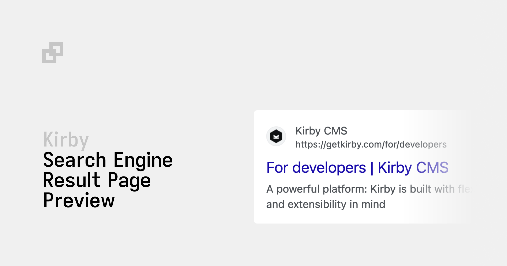

# Kirby SERP Preview

Kirby Panel plugin for search engine result page previews.

## Requirements

- Kirby 4+

Kirby is not free software. However, you can try Kirby and the Starterkit on your local machine or on a test server as long as you need to make sure it is the right tool for your next project. … and when you’re convinced, [buy your license](https://getkirby.com/buy).

## Installation

### Composer

```bash
composer require johannschopplich/kirby-serp-preview
```

### Download

Download and copy this repository to `/site/plugins/kirby-serp-preview`.

## Getting Started

Create a new section in one of your blueprints:

```yml
sections:
  serp-preview:
    type: serp-preview
    siteTitle: "{{ site.title.value }}"
    siteUrl: "{{ site.url }}"
    # Optional field to override the computed title
    titleContentKey: metaTitle
    descriptionContentKey: metaDescription
    # Optional fallback if the field above is empty
    descriptionFallback: "{{ site.metaDescription.value }}"
```

## Usage

### Page Title

By default, the SERP preview will render the title of the search engine result page preview by connecting the following values with a space:

1️⃣ **Page Title** + 2️⃣ **Title Separator** (defaults to `–`) + 3️⃣ **Site Title**

The `titleContentKey` section property allows you to define a custom content key for the page's title. If it is set and the field contains a value, it will override the computed title.

## Configuration

The following options are available:

| Option                  | Type   | Default                    | Description                                                                                                                             |
| ----------------------- | ------ | -------------------------- | --------------------------------------------------------------------------------------------------------------------------------------- |
| `faviconUrl`            | String | `null`                     | The URL to the favicon.                                                                                                                 |
| `siteTitle`             | String | `"{{ site.title.value }}"` | The site title.                                                                                                                         |
| `siteUrl`               | String | `"{{ site.url }}"`         | The site URL.                                                                                                                           |
| `titleSeparator`        | String | `"-"`                      | The title separator between the page's and the site title. Only applies if no `titleContentKey` is set the target field value is empty. |
| `titleContentKey`       | String | `null`                     | The content key for a custom title.                                                                                                     |
| `descriptionContentKey` | String | `null`                     | The content key for the page's custom description.                                                                                      |
| `descriptionFallback`   | String | `null`                     | Plain text or Kirby query to use as a fallback if the `descriptionContentKey` is empty.                                                 |
| `searchConsoleUrl`      | String | `null`                     | If provided, the section will display a link to the Google Search Console.                                                              |

Selected options support Kirby queries as values. For example, you can use `{{ site.title.value }}` to use the site's title:

- `siteTitle`
- `siteUrl`
- `titleSeparator`
- `descriptionFallback`

## License

[MIT](./LICENSE) License © 2023-PRESENT [Johann Schopplich](https://github.com/johannschopplich)

[MIT](./LICENSE) License © 2023-PRESENT [Dennis Baum](https://github.com/dennisbaum)
