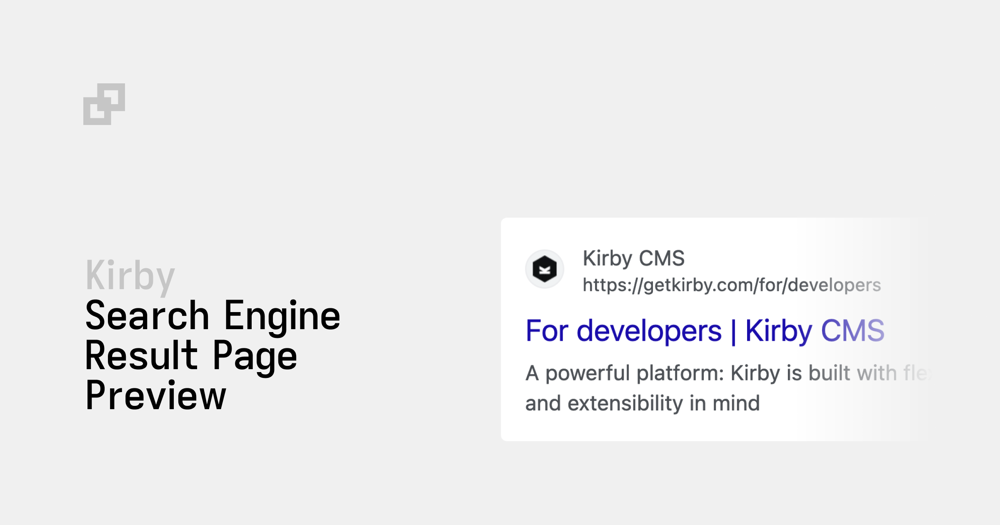

# Kirby SERP Preview

See exactly how your pages will appear in Google search results – updating live as you edit, right in the Kirby Panel.

## Features

- ⚡ Live preview that updates as you type
- 🎯 Google-style search result snippet in the Panel
- 🌓 Dark and light mode – adapts to the Panel theme with Google's own colors
- 🧩 Kirby query language support in configuration
- 🗺️ Multi-language ready
- ✂️ Custom formatters for title and description
- 📊 Optional Google Search Console link

## Requirements

- Kirby 4 or Kirby 5

## Installation

### Composer

```bash
composer require johannschopplich/kirby-serp-preview
```

### Download

Download and copy this repository to `/site/plugins/kirby-serp-preview`.

## Quick Start

Add the section to any page blueprint:

```yml
sections:
  serp-preview:
    type: serp-preview
```

That's it. The preview shows:

- **Title:** page title + separator + site title
- **URL:** your site URL + page path
- **Description:** empty until configured

## Configuration

### Full Example

```yml
sections:
  serp-preview:
    type: serp-preview
    # Site information
    siteTitle: "{{ site.title.value }}"
    siteUrl: "{{ kirby.url }}"
    faviconUrl: "{{ site.favicon.toFile.url }}"
    titleSeparator: "-"
    # Custom title (overrides default)
    titleContentKey: metaTitle
    defaultTitle: "{{ page.title.value }}"
    # Custom description
    descriptionContentKey: metaDescription
    defaultDescription: "{{ site.metaDescription.value }}"
    # Optional
    searchConsoleUrl: "https://search.google.com/search-console"
```

### Options

Options marked **Query** support [Kirby's query language](https://getkirby.com/docs/guide/blueprints/query-language), e.g. `{{ site.title.value }}`.

| Option                  | Default                  | Query | Description                                                 |
| ----------------------- | ------------------------ | ----- | ----------------------------------------------------------- |
| `siteTitle`             | `{{ site.title.value }}` | Yes   | Site name shown in the preview                              |
| `siteUrl`               | `{{ kirby.url }}`        | Yes   | Site URL shown in the preview                               |
| `faviconUrl`            | –                        | Yes   | URL to your favicon                                         |
| `titleSeparator`        | `–`                      | Yes   | Separator between page title and site title                 |
| `titleContentKey`       | –                        | No    | Field name for a custom title (e.g. `metaTitle`)            |
| `defaultTitle`          | –                        | Yes   | Fallback title if `titleContentKey` is empty                |
| `descriptionContentKey` | –                        | No    | Field name for a custom description (e.g. `metaDescription`) |
| `defaultDescription`    | –                        | Yes   | Fallback description if `descriptionContentKey` is empty     |
| `searchConsoleUrl`      | –                        | No    | Shows a link button to Google Search Console                |

### Title & Description Resolution

**Title** resolves in this order:

1. Value of the `titleContentKey` field, if set
2. `defaultTitle`, if configured
3. Page title + separator + site title (e.g. `About Us – My Website`)

**Description** resolves in this order:

1. Value of the `descriptionContentKey` field, if set
2. `defaultDescription`, if configured
3. No description shown

## Custom Formatters

Transform the title and description before they are displayed – useful for truncating text, stripping HTML, or applying other adjustments. Formatters are defined in your configuration and receive the current value and the page object, so transformations can be page-specific:

```php
// site/config/config.php
use Kirby\Toolkit\Str;

return [
    'johannschopplich.serp-preview' => [
        'formatters' => [
            'title' => function (string $value, \Kirby\Cms\Page $page) {
                // Example: limit the title length
                return Str::short($value, 60);
            },
            'description' => function (string $value, \Kirby\Cms\Page $page) {
                // Example: strip HTML and limit the length
                return Str::short(strip_tags($value), 160);
            }
        ]
    ]
];
```

## License

[MIT](./LICENSE) License © 2023-PRESENT [Johann Schopplich](https://github.com/johannschopplich)

[MIT](./LICENSE) License © 2023 [Dennis Baum](https://github.com/dennisbaum)
