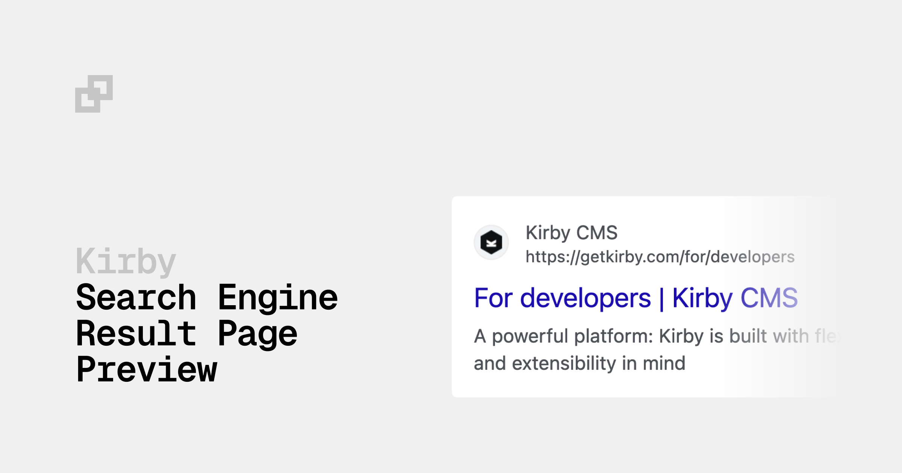

# Kirby SERP Preview

Preview how your pages will appear in Google search results, directly in the Kirby Panel.

## Features

- Google-style search result preview in the Panel
- Dark and light mode support (adapts to Panel theme)
- Kirby query language support in configuration
- Multi-language ready
- Custom formatters for title and description
- Optional Google Search Console link

> [!TIP]
> Ready for Kirby 5! The plugin adapts to the Panel theme and uses Google's dark mode colors.

## Requirements

- Kirby 4 or Kirby 5

## Installation

### Composer

```bash
composer require johannschopplich/kirby-serp-preview
```

### Download

Download and copy this repository to `/site/plugins/kirby-serp-preview`.

## Quick Start

Add the section to any page blueprint:

```yml
sections:
  serp-preview:
    type: serp-preview
```

That's it! The preview will show:

- **Title:** Page title + separator + site title
- **URL:** Your site URL + page path
- **Description:** Empty (until configured)

## Configuration

### Full Example

```yml
sections:
  serp-preview:
    type: serp-preview
    # Site information
    siteTitle: "{{ site.title.value }}"
    siteUrl: "{{ kirby.url }}"
    faviconUrl: "{{ site.favicon.toFile.url }}"
    titleSeparator: "-"
    # Custom title (overrides default)
    titleContentKey: metaTitle
    defaultTitle: "{{ page.title.value }}"
    # Custom description
    descriptionContentKey: metaDescription
    defaultDescription: "{{ site.metaDescription.value }}"
    # Optional
    searchConsoleUrl: "https://search.google.com/search-console"
```

### Options Reference

Options marked with **Query** support [Kirby's query language](https://getkirby.com/docs/guide/blueprints/query-language), e.g. `{{ site.title.value }}`.

| Option                  | Default                  | Query | Description                                                |
| ----------------------- | ------------------------ | ----- | ---------------------------------------------------------- |
| `siteTitle`             | `{{ site.title.value }}` | Yes   | Site name shown in the preview                             |
| `siteUrl`               | `{{ kirby.url }}`        | Yes   | Site URL shown in the preview                              |
| `faviconUrl`            | –                        | Yes   | URL to your favicon                                        |
| `titleSeparator`        | `–`                      | Yes   | Separator between page title and site title                |
| `titleContentKey`       | –                        | No    | Field name for custom title (e.g. `metaTitle`)             |
| `defaultTitle`          | –                        | Yes   | Fallback title if `titleContentKey` is empty               |
| `descriptionContentKey` | –                        | No    | Field name for custom description (e.g. `metaDescription`) |
| `defaultDescription`    | –                        | Yes   | Fallback description if `descriptionContentKey` is empty   |
| `searchConsoleUrl`      | –                        | No    | Shows a link button to Google Search Console               |

## How It Works

### Title Resolution

The preview title is determined in this order:

```
┌─────────────────────────────────────────────────────────────┐
│                                                             │
│  1. titleContentKey field has value?                        │
│     ├─ YES → Use field value                                │
│     └─ NO  ↓                                                │
│                                                             │
│  2. defaultTitle is configured?                             │
│     ├─ YES → Use defaultTitle (query supported)             │
│     └─ NO  ↓                                                │
│                                                             │
│  3. Fallback: Page Title + Separator + Site Title           │
│     → "About Us – My Website"                               │
│                                                             │
└─────────────────────────────────────────────────────────────┘
```

### Description Resolution

The preview description is determined in this order:

```
┌─────────────────────────────────────────────────────────────┐
│                                                             │
│  1. descriptionContentKey field has value?                  │
│     ├─ YES → Use field value                                │
│     └─ NO  ↓                                                │
│                                                             │
│  2. defaultDescription is configured?                       │
│     ├─ YES → Use defaultDescription (query supported)       │
│     └─ NO  → No description shown                           │
│                                                             │
└─────────────────────────────────────────────────────────────┘
```

## Custom Formatters

You can transform the title and description before they are displayed using custom formatters. This is useful for truncating text, removing HTML, or applying other transformations.

```php
// site/config/config.php
return [
    'johannschopplich.serp-preview' => [
        'formatters' => [
            'title' => function (string $value, Kirby\Cms\Page $page) {
                // Example: Limit title length
                return Str::short($value, 60);
            },
            'description' => function (string $value, Kirby\Cms\Page $page) {
                // Example: Strip HTML and limit length
                return Str::short(strip_tags($value), 160);
            }
        ]
    ]
];
```

The formatter receives the current value and the page object, allowing page-specific transformations.

## License

[MIT](./LICENSE) License © 2023-PRESENT [Johann Schopplich](https://github.com/johannschopplich)

[MIT](./LICENSE) License © 2023 [Dennis Baum](https://github.com/dennisbaum)
